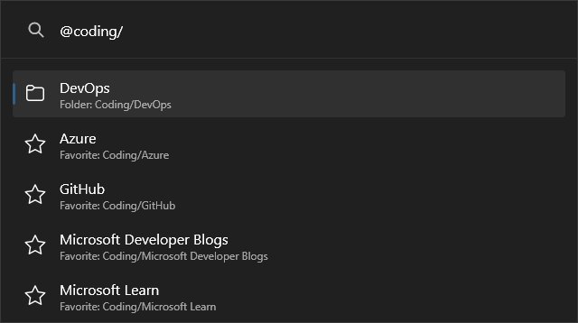

# PowerToys Run: Edge Favorite plugin

Simple [PowerToys Run](https://learn.microsoft.com/windows/powertoys/run) experimental plugin for search Microsoft Edge favorites.

## Important

- Not planning to support other browsers, so please do not ask
- The plugin is developed for the new Microsoft Edge based on Chromium
- The plugin is built on top of the `%LOCALAPPDATA%\Microsoft\Edge\User Data\Default\Bookmarks` and may stop working in case of changes to Microsoft Edge

## Requirements

- Microsoft Edge set as default browser
- PowerToys minimum version 0.76.0

## Installation

- Download the [latest release](https://github.com/davidegiacometti/PowerToys-Run-EdgeFavorite/releases/) by selecting the architecture that matches your machine: `x64` (more common) or `ARM64`
- Close PowerToys
- Extract the archive to `%LOCALAPPDATA%\Microsoft\PowerToys\PowerToys Run\Plugins`
- Open PowerToys

## Screenshots

